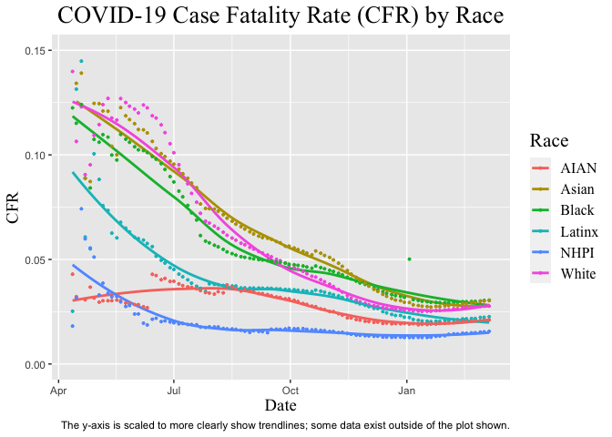

Project 1: COVID-19 Case Fatality Rate by Race
================
Zoë McGinnis, Celvi Lisy, Oscar De La Garza, Anusha Karandikar, &
Priscila Morales
2021-10-19

-   [Dataset Information](#dataset-information)
-   [Background Information](#background-information)
-   [The Big Picture](#the-big-picture)
-   [Leading question](#leading-question)
-   [Acquire the Data](#acquire-the-data)
    -   [Load the data set into the following name `df_race` and tidy
        it.](#load-the-data-set-into-the-following-name-df_race-and-tidy-it)
-   [Analyzing the data](#analyzing-the-data)
    -   [Including Plots](#including-plots)
-   [Conclusions](#conclusions)
-   [Remaining Questions](#remaining-questions)
-   [Works Cited](#works-cited)

*Purpose*: In this project, we learned how to find useful data and
perform a state-level population-weighted analysis of current COVID-19
race trends.

# Dataset Information

We used The COVID Tracking Project “COVID Racial Data Tracker.” This
dataset tracks the race and ethnicity data for COVID-19 cases in US
states and territories that report it. 51 out of the 56 states and
territories track this data. This dataset contains the variables `date`,
`state`, `cases`, `deaths`, `hospitalizations`, and `tests` stratified
by race. The different races represented were `AIAN` (American
Indian/American Native), `Asian`, `Black`, `Latinx`, `multiracial`,
`NHPI` (Native Hawaiian/Pacific Islander), `unknown`, and `White`. In
order to find the case fatality rate, we computed the deaths over cases
per day for each of the different races represented in the data set.

As far as the data quality, The COVID Tracking Project cross checks all
of its data and sources from state and territory public health
authorities and statements from state officials. However, the program
itself claims that the data is “incomplete and inconsistent.” The
dataset is missing death and/or cases data for the following states and
territories: `Guam`, `Hawaii`, `Louisiana`, `Montana`, `New York`,
`North Dakota`, `Northern Mariana Islands`, `Puerto Rico`,
`Virgin Islands` and `West Virginia`. Additionally, the COVID Tracking
Project stopped collecting new data as of March 7, 2021, which should be
kept in mind when analyzing the data.

# Background Information

[COVID-19](https://en.wikipedia.org/wiki/Coronavirus_disease_2019) is
the disease caused by the virus SARS-CoV-2. On January 30, 2020, the
World Health Organization (WHO) declared the outbreak a “public health
emergency of international concern” (PHEIC) \[1\]. Shortly afterward, it
became a global pandemic, leading to huge loss of life and tremendous
disruption of society, especially those in minority communities.

The United States is home to persistent racial disparities in health
coverage, chronic health conditions, and mortality. Poor health
indicators have consistently trended upward among minority groups
relative to non-Hispanic White adults \[2\]. Similarly, persons from
racial and ethnic minority groups are disproportionately affected by
COVID-19. Racial and ethnic disparities in COVID-19 case fatality rates
are likely driven by a higher risk for exposure to COVID-19 and severe
COVID-19 disease (e.g minority groups have a higher prevalence of
underlying medical conditions), both of which are influenced by social
determinants of health.

Using the COVID Tracking Project data set, we assessed monthly trends in
the case fatality rates of COVID-19 among racial and ethnic groups in
the United States from January 2020 through March 2021 \[3\].

# The Big Picture

<!-- -------------------------------------------------- -->

We want to study COVID-19 in terms of data: case fatality rate (CFR).
The case fatality rate (CFR) is simply the number of confirmed deaths
divided by the number of confirmed cases. We’re going to do a race group
analysis in order to get a view of race trends throughout the pandemic.

# Leading question

How is race correlated to case fatality rate in COVID cases?

# Acquire the Data

<!-- -------------------------------------------------- -->

1.  Racially disaggregated data from the [COVID Tracking
    Project](https://covidtracking.com/race)

## Load the data set into the following name `df_race` and tidy it.

``` r
## TASK: Load the COVID Tracking data with the tibble name.
race_csv = "./data/CRDT.csv"
df_race <- read.csv(race_csv)
```

<!-- -------------------------------------------------- -->

To get a sense of our tidying task, let’s take a glimpse at our data
source.

``` r
glimpse(df_race)
```

    ## Rows: 5,320
    ## Columns: 54
    ## $ Date                         <int> 20210307, 20210307, 20210307, 20210307, 2…
    ## $ State                        <chr> "AK", "AL", "AR", "AS", "AZ", "CA", "CO",…
    ## $ Cases_Total                  <int> 59332, 499819, 324818, NA, 826454, 350139…
    ## $ Cases_White                  <int> 18300, 160347, 207596, NA, 308453, 546630…
    ## $ Cases_Black                  <int> 1499, 82790, 50842, NA, 25775, 111279, 12…
    ## $ Cases_Latinx                 <int> NA, NA, NA, NA, 244539, 1509103, 119224, …
    ## $ Cases_Asian                  <int> 2447, 2273, 2913, NA, 11921, 186562, 6406…
    ## $ Cases_AIAN                   <int> 12238, NA, 1070, NA, 40707, 9025, 2527, 3…
    ## $ Cases_NHPI                   <int> 1508, NA, 3358, NA, NA, 15281, 1264, NA, …
    ## $ Cases_Multiracial            <int> 4453, NA, 1804, NA, NA, 42824, 6580, 1764…
    ## $ Cases_Other                  <int> 7130, 38000, 16491, NA, 46964, 304477, 33…
    ## $ Cases_Unknown                <int> 11757, 216409, 40744, NA, 148095, 776213,…
    ## $ Cases_Ethnicity_Hispanic     <int> 3197, 12312, 34332, NA, 244539, 1509103, …
    ## $ Cases_Ethnicity_NonHispanic  <int> 29625, 167064, 290486, NA, 433820, 121607…
    ## $ Cases_Ethnicity_Unknown      <int> 26510, 320443, 0, NA, 148095, 776213, 102…
    ## $ Deaths_Total                 <int> 305, 10148, 5319, NA, 16328, 54124, 5986,…
    ## $ Deaths_White                 <int> 127, 4730, 4171, NA, 8066, 16586, 3869, 5…
    ## $ Deaths_Black                 <int> 9, 2223, 784, NA, 433, 3275, 191, 906, 77…
    ## $ Deaths_Latinx                <int> NA, NA, NA, NA, 4684, 24402, 1204, 782, 1…
    ## $ Deaths_Asian                 <int> 29, 24, 36, NA, 220, 6105, 115, 83, 14, 1…
    ## $ Deaths_AIAN                  <int> 111, NA, 18, NA, 1361, 184, 37, 3, NA, NA…
    ## $ Deaths_NHPI                  <int> 17, NA, 56, NA, NA, 322, 9, NA, NA, NA, N…
    ## $ Deaths_Multiracial           <int> 4, NA, 13, NA, NA, 693, 186, 353, NA, NA,…
    ## $ Deaths_Other                 <int> 1, 300, 203, NA, 465, 1103, 38, 38, 0, 15…
    ## $ Deaths_Unknown               <int> 7, 2871, 38, NA, 1099, 1454, 337, 126, 19…
    ## $ Deaths_Ethnicity_Hispanic    <int> 13, 137, 186, NA, 4684, 24402, 1204, 782,…
    ## $ Deaths_Ethnicity_NonHispanic <int> 280, 6083, 5133, NA, 10545, 28268, 4445, …
    ## $ Deaths_Ethnicity_Unknown     <int> 12, 3928, 0, NA, 1099, 1454, 337, 126, 19…
    ## $ Hosp_Total                   <int> 1293, NA, NA, NA, 57907, NA, NA, NA, NA, …
    ## $ Hosp_White                   <int> 423, NA, NA, NA, 26710, NA, NA, NA, NA, N…
    ## $ Hosp_Black                   <int> 45, NA, NA, NA, 2479, NA, NA, NA, NA, NA,…
    ## $ Hosp_Latinx                  <int> NA, NA, NA, NA, 18730, NA, NA, NA, NA, NA…
    ## $ Hosp_Asian                   <int> 116, NA, NA, NA, 1015, NA, NA, NA, NA, NA…
    ## $ Hosp_AIAN                    <int> 336, NA, NA, NA, 4496, NA, NA, NA, NA, NA…
    ## $ Hosp_NHPI                    <int> 126, NA, NA, NA, NA, NA, NA, NA, NA, NA, …
    ## $ Hosp_Multiracial             <int> 67, NA, NA, NA, NA, NA, NA, NA, NA, NA, N…
    ## $ Hosp_Other                   <int> 54, NA, NA, NA, 2562, NA, NA, NA, NA, NA,…
    ## $ Hosp_Unknown                 <int> 126, NA, NA, NA, 1915, NA, NA, NA, NA, NA…
    ## $ Hosp_Ethnicity_Hispanic      <int> 66, NA, NA, NA, 18730, NA, NA, NA, NA, NA…
    ## $ Hosp_Ethnicity_NonHispanic   <int> 939, NA, NA, NA, 37262, NA, NA, NA, NA, N…
    ## $ Hosp_Ethnicity_Unknown       <int> 288, NA, NA, NA, 1915, NA, NA, NA, NA, NA…
    ## $ Tests_Total                  <int> NA, NA, NA, NA, NA, 49646014, NA, NA, NA,…
    ## $ Tests_White                  <int> NA, NA, NA, NA, NA, 9172498, NA, NA, NA, …
    ## $ Tests_Black                  <int> NA, NA, NA, NA, NA, 1730660, NA, NA, NA, …
    ## $ Tests_Latinx                 <int> NA, NA, NA, NA, NA, 9444459, NA, NA, NA, …
    ## $ Tests_Asian                  <int> NA, NA, NA, NA, NA, 3980518, NA, NA, NA, …
    ## $ Tests_AIAN                   <int> NA, NA, NA, NA, NA, 98894, NA, NA, NA, NA…
    ## $ Tests_NHPI                   <int> NA, NA, NA, NA, NA, 222513, NA, NA, NA, N…
    ## $ Tests_Multiracial            <int> NA, NA, NA, NA, NA, 74171, NA, NA, NA, NA…
    ## $ Tests_Other                  <int> NA, NA, NA, NA, NA, 6354689, NA, NA, NA, …
    ## $ Tests_Unknown                <int> NA, NA, NA, NA, NA, 18567612, NA, NA, NA,…
    ## $ Tests_Ethnicity_Hispanic     <int> NA, NA, NA, NA, NA, 9444459, NA, NA, NA, …
    ## $ Tests_Ethnicity_NonHispanic  <int> NA, NA, NA, NA, NA, 21633943, NA, NA, NA,…
    ## $ Tests_Ethnicity_Unknown      <int> NA, NA, NA, NA, NA, 18567612, NA, NA, NA,…

Now, let’s tidy the data.

``` r
df_cfr <- df_race %>%
  filter(
    State %in% state.abb
  ) %>%
  mutate(
    State = state.name[match(State, state.abb)],
    Date = as.Date(as.character(Date), tryFormats = c("%Y%m%d"))
  ) %>%
  rename(
    state = State,
    date = Date
  ) %>%
  select(-2) %>% 
  group_by(date) %>%
  summarize(Total_Cases = sum(Cases_Total, na.rm=TRUE),
         Total_White = sum(Cases_White, na.rm=TRUE),
         Total_Black = sum(Cases_Black, na.rm=TRUE),
         Total_Latinx = sum(Cases_Latinx, na.rm=TRUE),
         Total_Asian = sum(Cases_Asian, na.rm=TRUE),
         Total_AIAN = sum(Cases_AIAN, na.rm=TRUE),
         Total_NHPI = sum(Cases_NHPI, na.rm=TRUE),
         Total_Deaths = sum(Deaths_Total, na.rm=TRUE),
         Total_Deaths_White = sum(Deaths_White, na.rm=TRUE),
         Total_Deaths_Black = sum(Deaths_Black, na.rm=TRUE),
         Total_Deaths_Latinx = sum(Deaths_Latinx, na.rm=TRUE),
         Total_Deaths_Asian = sum(Deaths_Asian, na.rm=TRUE),
         Total_Deaths_AIAN = sum(Deaths_AIAN, na.rm=TRUE),
         Total_Deaths_NHPI = sum(Deaths_NHPI, na.rm=TRUE),
         White = (Total_Deaths_White)/Total_White,
         Black = (Total_Deaths_Black)/Total_Black,
         Latinx = (Total_Deaths_Latinx)/Total_Latinx,
         Asian = (Total_Deaths_Asian)/Total_Asian,
         AIAN = (Total_Deaths_AIAN)/Total_AIAN,
         NHPI = (Total_Deaths_NHPI)/Total_NHPI
         ) %>%
  pivot_longer(cols =White: NHPI,
               names_to = "race",
               values_to = "CFR"
               )
```

# Analyzing the data

<!-- -------------------------------------------------- -->

Now that we’ve done the hard work of loading and wrangling the data, we
can finally start our analysis. Our first step will be to produce a
graph of deaths/cases, known as the case fatality rate (CFR), over time
by race. Then we will explore the data.

## Including Plots

``` r
df_cfr %>%
  ggplot(mapping = aes(x = date, y = CFR, color = race, na.rm = TRUE)) + 
  labs(title = "COVID-19 Case Fatality Rate (CFR) by Race", 
       y = "CFR", 
       x = "Date",
       color = "Race",
       caption = "The y-axis is scaled to more clearly show trendlines; some data exist outside of the plot shown."
       ) +
  theme(axis.title.x = element_text(size = 14, family = "Times New Roman"),
        axis.title.y = element_text(size = 14, family = "Times New Roman"),
        plot.title = element_text(size = 20, family = "Times New Roman", hjust= 0.5),
        legend.title = element_text(size = 16, family = "Times New Roman"),
        legend.text = element_text(size = 12, family = "Times New Roman")
        ) +
  geom_smooth(se=F, na.rm = T) +
  geom_point(na.rm = T, size = .7) +
  ylim(0,.15)
```

    ## `geom_smooth()` using method = 'loess' and formula 'y ~ x'

<!-- -->

# Conclusions

The graph above shows a gradual decline in case fatality rates across
all races besides American Indians and Alaskan Natives (we suspect this
may be due to low or inconsistent reporting of deaths on reservations).
We speculate that this general downward trend might be a result of
improvement in treatment methods, increased awareness of the disease,
improvement in public health policies, and reduced strain on hospital
capacity and medical personnel.

The data do not appear to suggest any significant disparities in CFR by
race; although case fatality rates of Asian and Black populations
gradually climb above those of White populations, the trend lines
converge toward March of 2021, and do not stray too far from each other
throughout the graph. We theorize that if reporting were more
consistent, case fatality rates of minorities compared to that of the
White population might reflect the racial inequality present in US
institutions.

An interesting feature of the graph is the low CFR of Native Hawaiians
and Pacific Islanders. Although the death rate of the population appears
to be significantly lower than other races throughout the span of the
graph, Hawaii has the largest number of Native Hawaiians and Pacific
Islanders \[4\], and since they do not report data COVID-19 data by
race, we suspect this trend may be misleading.

# Remaining Questions

Our next steps would be to use either our existing data or find new data
to explore why we saw the patterns we did in the graph. If we choose to
focus on the data we have, we could break down the case fatality rate by
state to explore which states contribute most to the racial disparities
we see in the data. The data from The COVID Tracking Project includes
statistics for both testing and hospitalization rates by race, which
could potentially provide insight about the case fatality rates we
found. Both testing and hospitalization fall under the umbrella of
access to healthcare, which, from our background information research,
we believe could be correlated to race. Exploring transmission rates by
race (which is not in the data from The COVID Tracking Project) could
also give us further information about the relationship between race and
environment, and how racial disparities can put people in positions
where recommended precautions (ex. social distancing, masking) cannot be
fulfilled.

# Works Cited

\[1\] WHO Europe
[WHO](https://www.euro.who.int/en/health-topics/health-emergencies/international-health-regulations/news/news/2020/2/2019-ncov-outbreak-is-an-emergency-of-international-concern)
(2020)

\[2\] PMC article on health disparities
[PMC](https://www.ncbi.nlm.nih.gov/pmc/articles/PMC3540621/) (2012)

\[3\] COVID Tracking Tool [COVID Tool](https://covidtracking.com/race)
(2021)

\[4\] The Leadership Conference Fund [NHPI
Dataset](http://civilrightsdocs.info/pdf/census/2020/Table1a-States-Number-NHPI-HTC.pdf)
(2020)
